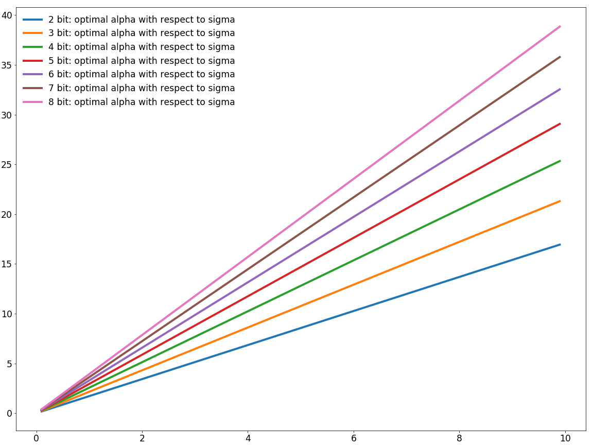

# ACIQ: ANALYTICAL CLIPPING FOR INTEGER QUANTIZATION OF NEURAL NETWORKS
This is complete example for applying Laplace and Gaussian clipping on activations of CNN.

## Dependencies
- python3.x
- [pytorch](<http://www.pytorch.org>)
- [torchvision](<https://github.com/pytorch/vision>) to load the datasets, perform image transforms
- [pandas](<http://pandas.pydata.org/>) for logging to csv
- [bokeh](<http://bokeh.pydata.org>) for training visualization

## Data
- To run this code you need validation set from ILSVRC2012 data
- Configure your dataset path by providing --data "PATH_TO_ILSVRC" or copy ILSVRC dir to ~/datasets/ILSVRC2012.
- To get the ILSVRC2012 data, you should register on their site for access: <http://www.image-net.org/>

## Building cuda kernels for GEMMLOWP
To improve performance GEMMLOWP quantization was implemented in cuda and requires to compile kernels.

- Create virtual environment for python3 and activate:
```
virtualenv --system-site-packages -p python3 venv3
. ./venv3/bin/activate
```
- build kernels
```
cd kernels
./build_all.sh
```

## Prepare setup for Inference
Low precision inference requires to find scale of low precision tensors ahead of time. In order to calculate scale we need to collect statistics of activations for specific topology and dataset.
### Collect statistics
```
python inference-sim -a resnet18 -b 512 --qtype int8 -sm collect
```
Statistics will be saved under ~/asiq_data/statistics folder.
### Run inference experiment
Following command line will evaluate resnet18 with 4bit activations and Laplace clipping
```
python inference-sim -a resnet18 -b 512 --qtype int4 -sm use -th laplace
```
`* Prec@1 65.728 Prec@5 86.706`

To evaluate non clipped version just omit -th or set "-th no"
```
python inference-sim -a resnet18 -b 512 --qtype int4 -sm use th no
```
`* Prec@1 53.206 Prec@5 76.860`

Laplace clipping improves top1 accuracy by 12.5% w/o retraining.

## Solution for optimal clipping

The best of our knowladge, differentiable equations presented in the paper doesn't have analytical solution. We solve those empirically using scipy library and find optimal alpha value for Gaussian and Laplace cases. 
We show linear dependency between optimal alpha and sigma for Gaussian case and optimal alpha and b for Laplace case.

[optimal_alpha.ipynb](optimal_alpha.ipynb)

Gaussian case, linear dependency


## Quantization with optimal clipping
In order to quantize tensor to M bit with optimal clipping we use GEMMLOWP quantization with small modification. We replace dynamic range in scale computation by 2*alpha where alpha is optimal clipping value.

Quantization code can be found here: 
[int_quantizer.py](pytorch_quantizer/quantization/qtypes/int_quantizer.py)
